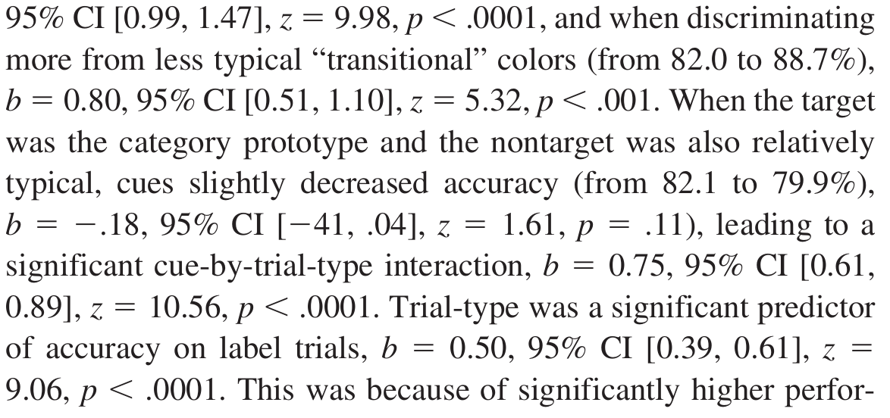

```{r, include=FALSE}
library(ggplot2)
library(pander)
panderOptions('round', 3)
panderOptions('keep.trailing.zeros', TRUE)
```


# What is reproducible research?
\framesubtitle{Or rather, what is reproducible data analysis?}
```{r, echo=F, out.width="0.5\\textwidth", fig.align='center',fig.cap="Part of a Results section in Forder \\& Lupyan (2019)."}

```

* Any research that involves statistical data analysis will usually contain many figures and tables of statistical results, and also numerous statistical results within the text. 

* The goal of reproducible research --- or rather, *reproducible data analysis* --- is that anyone working independently could recreate all of these results exactly.

# Necessary criteria for reproducible data analysis

* The following three criteria seem necessary for a given data analysis to be reproducible.

  1. The *raw* data must be available. Data that is processed and "cleaned up" is not sufficient. 
  1. All the code for all the analysis must be available. All the code for all the data analysis pipeline is required, as are the scripts and build tools that execute the code. 
  1. The reports of the analysis, e.g., journal articles, presentations slides, etc, must be made by *dynamic documents*. 

* @gentleman2007statistical introduced the concept of a *research compendium*, which is a single package that contains all of the raw data, all the code for all the data analysis pipeline, and dynamic documents that generate all the final reports.

# Software tools for reproducible data analysis

* There are numerous (open source, or freely available) software tools and service that facilitate creating and maintaining of a research compendium. These include the following:

  * RMarkdown (and knitr, pandoc, \LaTeX, etc)
  * Git & GitHub 
  * Make (and other build automation tools)
  * Jupyter
  * Docker and virtual machines
  * Git LFS, Git annex, Git fat, etc
  
* Here, we will deal with just the first two items on this list.

# What is RMarkdown?

* [RMarkdown](https://rmarkdown.rstudio.com/) is an R based dynamic document format. It is used with [knitr](https://yihui.name/knitr/) to generate documents in different formats that combine text with
content, including figures, tables, etc., that are dynamically generated by R (or other languages).

* It can be used to create publication ready manuscripts, slides for presentations, scientific posters.

* It, and its variants `bookdown`, `blogdown`, `pkgdown`, etc, can be used to create books, websites, interactive online demos and tutorials, etc.

# RMarkdown overview: Example 1

We write source code that is mixture of R code and explanatory text that optionally references the R variables.

```{r echo = FALSE, comment = ""}
cat(htmltools::includeText("include/rmarkdown-example-chunk-1.Rmd"))
```

# RMarkdown overview: Example 1 (rendered)

When we render this, we'll produce a document (in this case, \LaTeX) with both the code and any output and any evaluated variables in the text.

```{r, child = 'include/rmarkdown-example-chunk-1.Rmd'}
```


# RMarkdown overview: Example 2

We may turn off the rendering of the R source code with `echo = FALSE`. 

```{r echo = FALSE, comment = ""}
cat(htmltools::includeText("include/rmarkdown-example-chunk-2.Rmd"))
```

# RMarkdown overview: Example 2 (rendered)

Then we get e.g. just the rendered text, but not the R *chunk*.

```{r, child = 'include/rmarkdown-example-chunk-2.Rmd'}
```


# RMarkdown overview: Example 3

Figures will be rendered and inserted into the document in an identical manner.

```{r echo = FALSE, comment = ""}
cat(htmltools::includeText("include/rmarkdown-example-chunk-3.Rmd"))
```

# RMarkdown overview: Example 3 (rendered)


```{r, child = 'include/rmarkdown-example-chunk-3.Rmd'}
```


# RMarkdown overview: Example 4

Likewise, tables from statistical models can be rendered and inserted into the document.

```{r echo = FALSE, comment = ""}
cat(htmltools::includeText("include/rmarkdown-example-chunk-4.Rmd"))
```

# RMarkdown overview: Example 4 (rendered)


```{r, child = 'include/rmarkdown-example-chunk-4.Rmd'}
```


# RMarkdown overview: Example 5

RMarkdown allows us to typeset mathematical equations, symbols, etc., just as we would do with \LaTeX.

```{r echo = FALSE, comment = ""}
cat(htmltools::includeText("include/rmarkdown-example-chunk-5.Rmd"))
```

# RMarkdown overview: Example 5 (rendered)


```{r, child = 'include/rmarkdown-example-chunk-5.Rmd'}
```


# What we'll cover in this workshop
\framesubtitle{More or less in this order too}

* How to create an RMarkdown document from scratch, including the basics of the RMarkdown YAML header.
* How to *knit* rmarkdown documents with R chunks and inline R code.
* The details of the markdown syntax.
* How to include math(s) using \LaTeX\ code.
* How to include figures and tables and control their presentation.
* How to include citations.
* How to use different document templates, include `papaja`.
* How to make \LaTeX\ beamer^[These slides are made with RMarkdown rendering to its \LaTeX\ beamer output.] and html based slides.  


# What is Git?

* Git is version control software, initially developed for version control of the Linux operating system kernel.
* It is now extremely widely used for almost all kinds of software development projects. 
* Git works on a decentralized system whereby a code-base can be *cloned*, developed independently, and possible re-merged. 
* For collaborating on one project, two developers use a *remote* host, clone it, develop locally, *commit* and then *push* back to and *pull* from the remote host.
* GitHub is one of the most widely used hosting sites (but there are others, e.g. BitBucket; and running your own git hosting server is simple and inexpensive).

# What should we care?

* Git (and a Git server) provides a means of sharing your research compendium and its updates, and this can be done from the beginning of the research and continually throughout its entire development.
* But it's not just another "dropbox": It is distributed version control system. 
  * It allows open, distributed, collaborative development of research and data analysis code, like the open source development model for software generally.
  * Even for small teams, it provides a means for efficient and organized development of source code, including (and especially) for writing the source code for our articles, slides, etc (remember (what usually happens)[http://phdcomics.com/archive_print.php?comicid=1531]). 
  * Even for individuals, it allows for efficient and organized development of our source code.
  * And it is (almost) endlessly fault tolerant. So long as there is one clone somewhere, the entire project and its version history is preserved entirely.

* Git is designed for source code (i.e. text files) management. Data and other "assets" can be attached to (rather than kept within) the repository using `git fat`, `git annex`, `git lfs`, etc.

# Git: Tiny tutorial

- Start by cloning a remote repository:
```{r, engine = 'bash', eval = FALSE}
      git clone https://github.com/yihui/knitr.git
      cd knitr
      git log # Read all the commit logs
```
- Work as normal, i.e. edit files, create new files, delete files. 
- You now *stage* your changes, e.g.
```{r, engine = 'bash', eval = FALSE}
      git add foo.file.1 foo.file.2 # for edits or new files
      git rm foo.file.3 # for removed files
```
- You then *commit* these:
```{r, engine = 'bash', eval = FALSE}
      git commit # Editor opens for your log msg
```


# Git: Tiny tutorial (2)

- Pull down any recent changes by others from the remote:
```{r, engine = 'bash', eval = FALSE}
      git pull
      git log # If new changes, read their logs
```
- Now, push your own changes to the remote
```{r, engine = 'bash', eval = FALSE}
      git push # requires permissions
```

- Undo changes:
```{r, engine = 'bash', eval = FALSE}
      git reset a381f2f # move back "head"
      git revert a381f2f # applies new change to revert 
```


# References
